# Three-Tier Web Application Deployment on AWS EKS using AWS EKS, ArgoCD, Prometheus, Grafana, and Jenkins!

  
  
  
  

Welcome to the Three-Tier Web Application Deployment project! 🚀

Achieved approximately 1K RPS at sub-250ms P95 latency with 99.9% uptime by designing a scalable microservices architecture deployed on AWS EKS, built for high availability, fault tolerance, and distributed systems reliability. 

The system follows a 3-tier microservices-based architecture (React frontend, Node.js backend exposing REST APIs, MongoDB database), with services decoupled and independently scalable, and traffic managed through load balancing and autoscaling policies across a multi-node Kubernetes cluster. Leveraged container orchestration using Kubernetes to manage 25+ containerized workloads across 15–30 pods, ensuring resilience through self-healing, rolling deployments, and horizontal scaling. Provisioned the entire infrastructure using Infrastructure as Code (Terraform), enabling reproducible and production-grade environments. 

Built a DevSecOps pipeline with CI/CD (Jenkins) integrating SonarQube (static code analysis) and Trivy (container vulnerability scanning) to enforce secure and high-quality releases. Implemented GitOps using ArgoCD for declarative, automated deployments, and integrated real-time observability (Prometheus + Grafana) to monitor system metrics, resource utilization, and service health, enabling proactive debugging and performance optimization.

## 🚧 Challenges Faced & Solutions

- **Jenkins Pipeline & Terraform Failures**  
  Initial pipeline executions failed due to misconfigured Terraform scripts and insufficient IAM permissions. Resolved by validating configurations, correcting scripts, and ensuring Jenkins had proper AWS access.

- **EKS Node Registration Failure**  
  Node groups were created and EC2 instances launched, but no nodes appeared in the cluster. Fixed by identifying IAM role mismatch and correctly mapping the node role in the `aws-auth` ConfigMap.

- **IAM Role Misconfiguration for Nodes**  
  Worker nodes lacked required permissions, causing failures in cluster join and image pulls. Resolved by attaching necessary policies: `AmazonEKSWorkerNodePolicy`, `AmazonEKS_CNI_Policy`, and `AmazonEC2ContainerRegistryReadOnly`.

- **aws-auth ConfigMap Editing Issues**  
  Faced repeated errors due to incorrect YAML formatting and invalid updates. Fixed by properly structuring `mapRoles` and `mapUsers` with correct indentation and valid IAM role ARNs.

- **ImagePullBackOff & ECR Access Errors**  
  Pods failed with `403 Forbidden` while pulling images from ECR. Resolved by granting ECR read permissions to node IAM role and recreating nodes to apply updated credentials.

- **Node Group Degraded State**  
  Node groups entered a degraded state as instances failed to bootstrap and join the cluster. Diagnosed using logs and resolved by fixing IAM roles, aws-auth mapping, and recreating node groups.

- **Node Bootstrap & Cluster Connectivity Issues**  
  EC2 nodes failed to register due to bootstrap and connectivity issues. Debugged using kubelet logs and ensured proper cluster endpoint access.

- **Networking & Internet Access Problems**  
  Nodes couldn’t reach EKS API/ECR due to subnet/NAT or security group misconfigurations. Fixed by verifying outbound connectivity, route tables, and required network rules.

- **Kubernetes Debugging Complexity**  
  Troubleshooting required deep inspection across IAM, networking, and Kubernetes layers. Developed a systematic debugging approach using `kubectl describe`, logs, and AWS CLI.

- **ArgoCD Deployment Failures**  
  Applications failed to deploy due to incorrect IAM roles and cluster access issues. Resolved by aligning permissions and ensuring proper cluster connectivity.

## 📸 Project Screenshots

---

### 🚀 ArgoCD Deployment

View Screenshots

  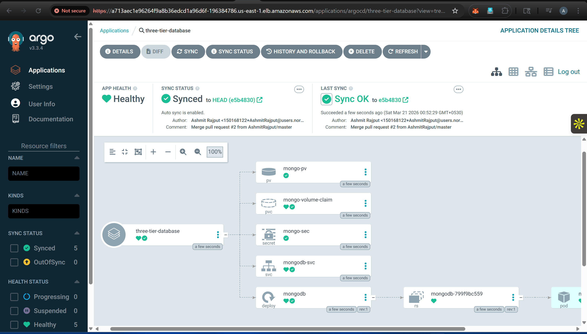
  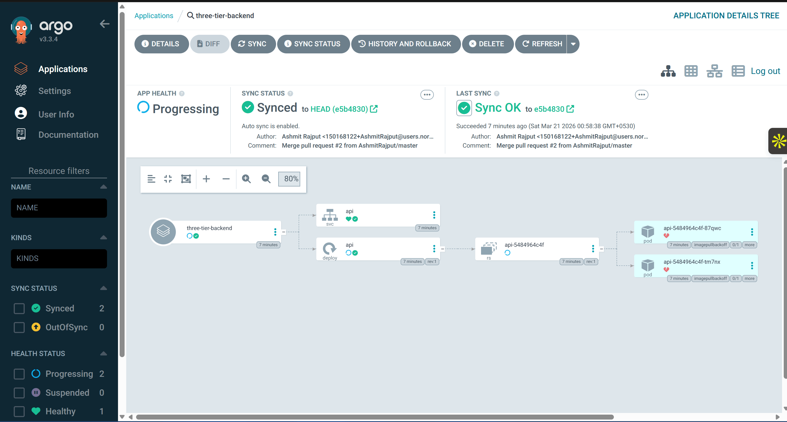
  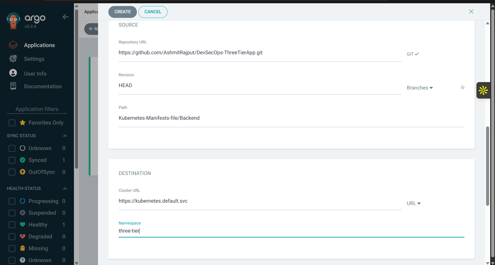

---

### ☸️ EKS Cluster & Nodes

View Screenshots

  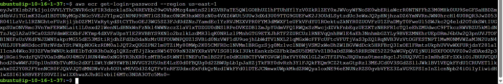
  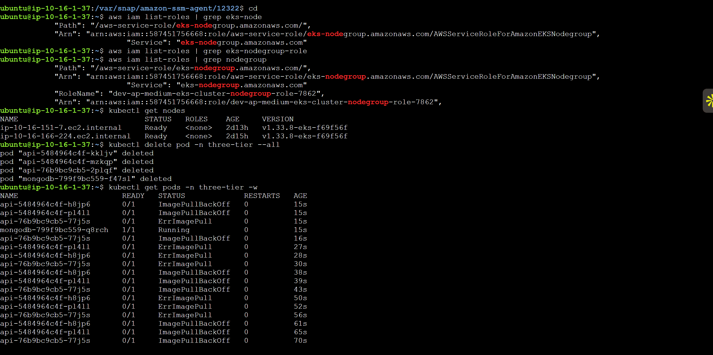

  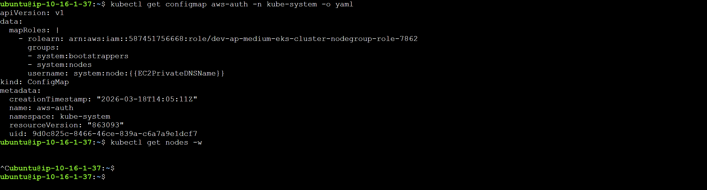
  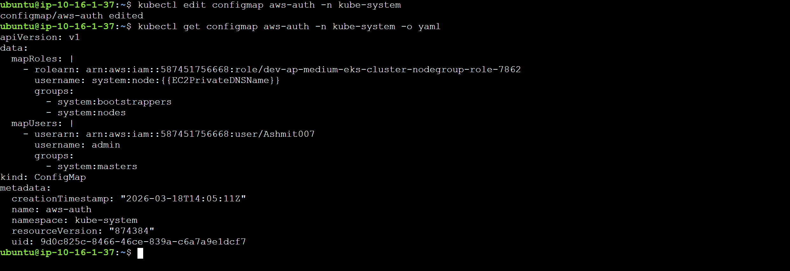

  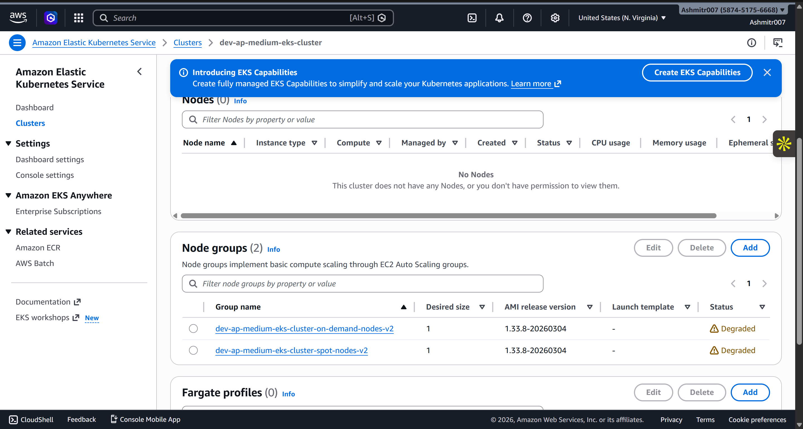
  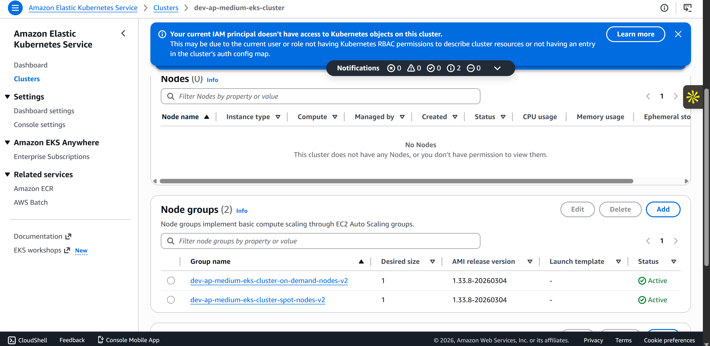

---

### ⚙️ Jenkins CI/CD Pipeline

View Screenshots

  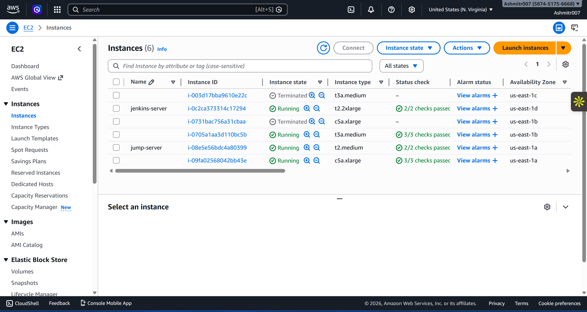
  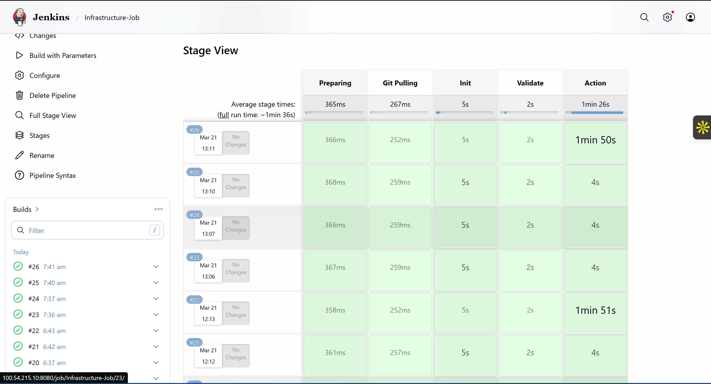

  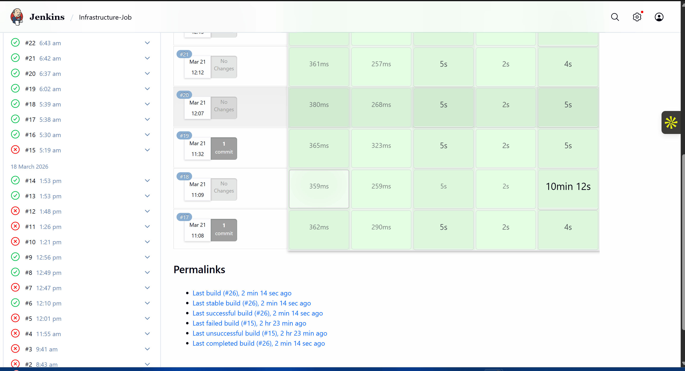

---

### 🏗️ Terraform Infrastructure

View Screenshots

  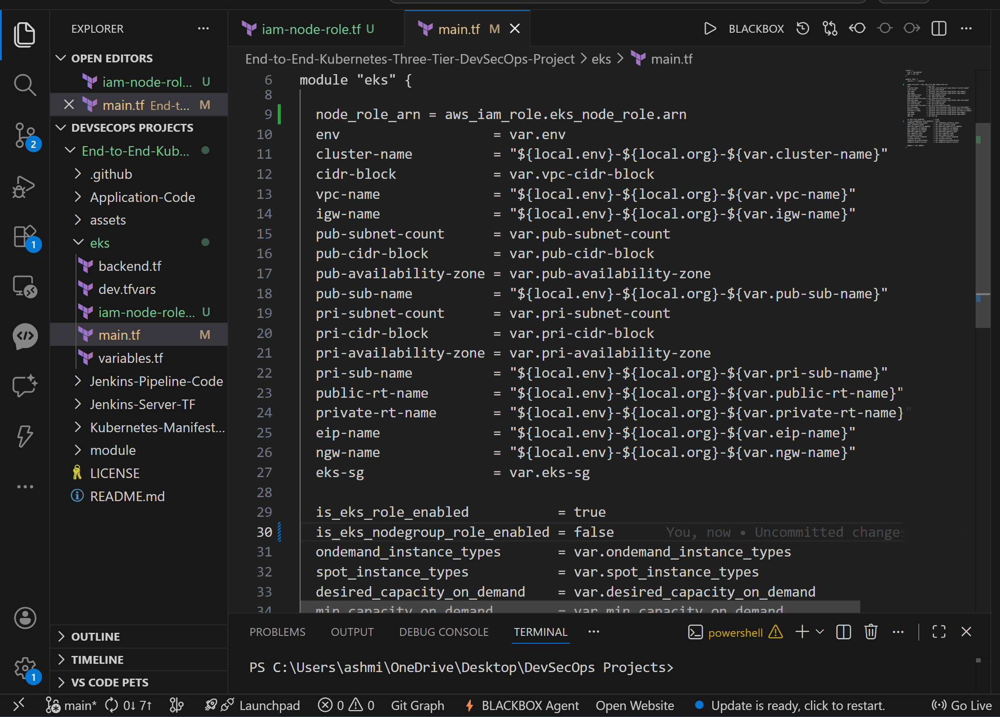
  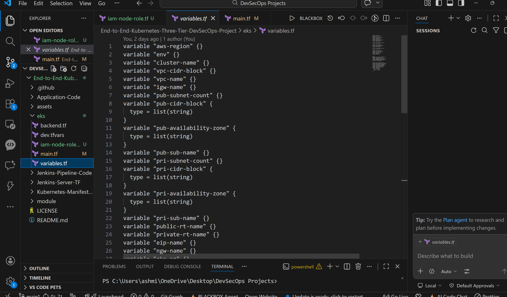

  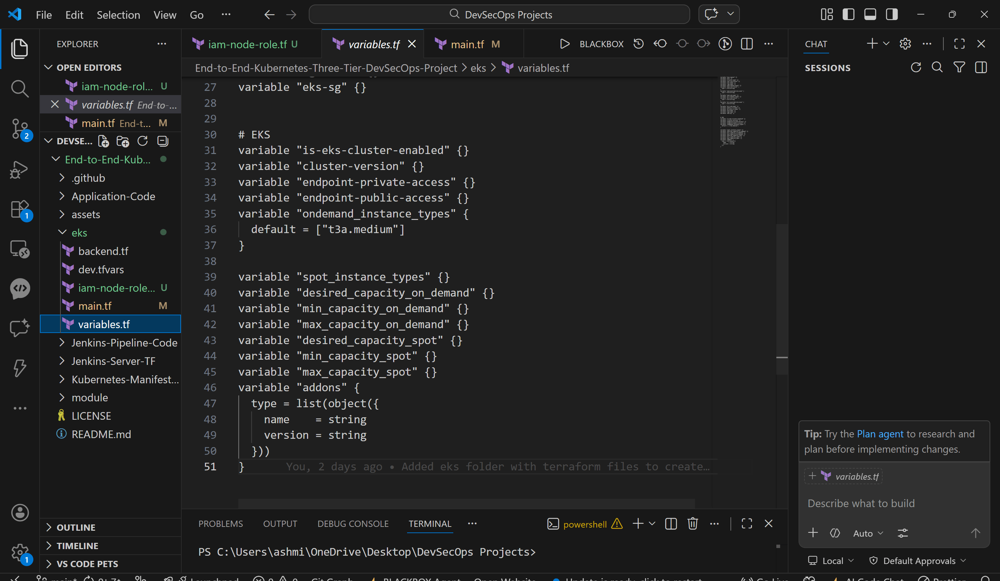
  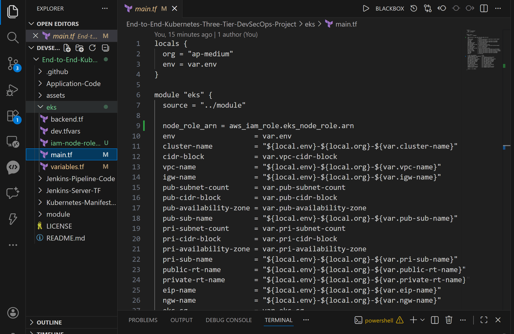

## Table of Contents
- [Application Code](#application-code)
- [Jenkins Pipeline Code](#jenkins-pipeline-code)
- [Jenkins Server Terraform](#jenkins-server-terraform)
- [Elastic Kubernetes Terraform](#eks)
- [Kubernetes Manifests Files](#kubernetes-manifests-files)
- [Project Details](#project-details)

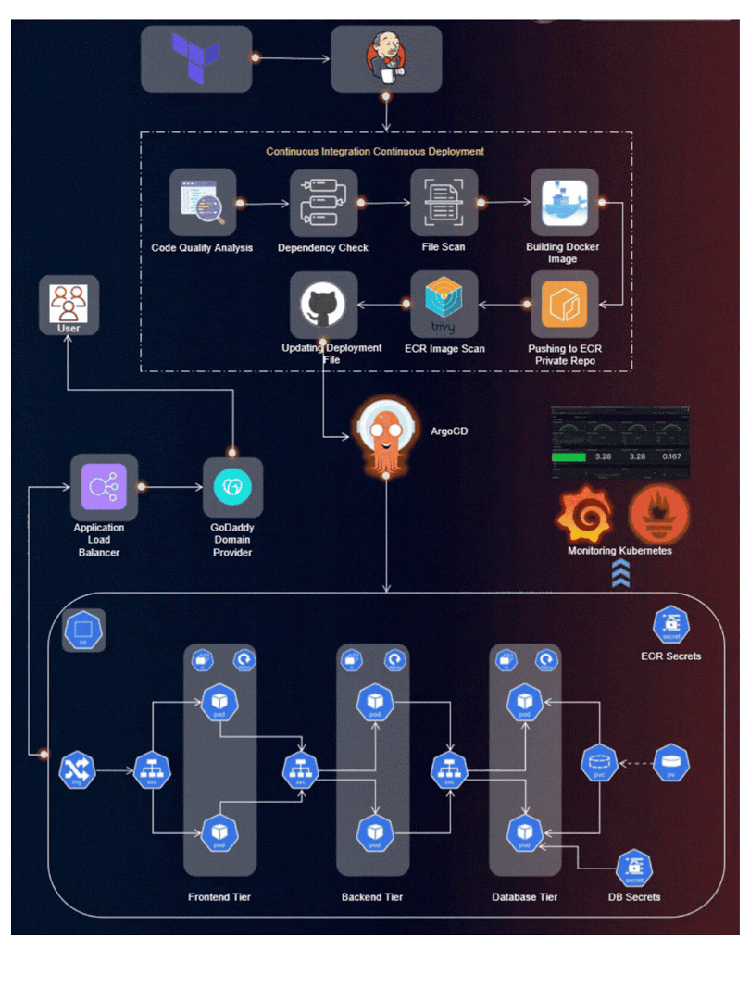

## Application Code
The `Application-Code` directory contains the source code for the Three-Tier Web Application. Dive into this directory to explore the frontend and backend implementations.

## Jenkins Pipeline Code
In the `Jenkins-Pipeline-Code` directory, you'll find Jenkins pipeline scripts. These scripts automate the CI/CD process, ensuring smooth integration and deployment of your application.

## Jenkins Server Terraform
Explore the `Jenkins-Server-TF` directory to find Terraform scripts for setting up the Jenkins Server on AWS. These scripts simplify the infrastructure provisioning process.

## EKS Terraform 
The `eks` directory holds Terraform files our terraform finds to setup VPC and EKS Clusters in its subnets using the specified variables and backend as specified.

## Kubernetes Manifests Files
The `Kubernetes-Manifests-Files` directory holds Kubernetes manifests for deploying your application on AWS EKS. Understand and customize these files to suit your project needs.

## Project Details
🛠️ **Tools Explored:**
- Terraform & AWS CLI for AWS infrastructure
- Jenkins, Sonarqube, Terraform, Kubectl, and more for CI/CD setup
- Helm, Prometheus, and Grafana for Monitoring
- ArgoCD for GitOps practices

🚢 **High-Level Overview:**
- IAM User setup & Terraform magic on AWS
- Jenkins deployment with AWS integration
- EKS Cluster creation & Load Balancer configuration
- Private ECR repositories for secure image management
- Helm charts for efficient monitoring setup
- GitOps with ArgoCD - the cherry on top!

📈 **The journey covered everything from setting up tools to deploying a Three-Tier app, ensuring data persistence, and implementing CI/CD pipelines.**

Happy Coding! 🚀
